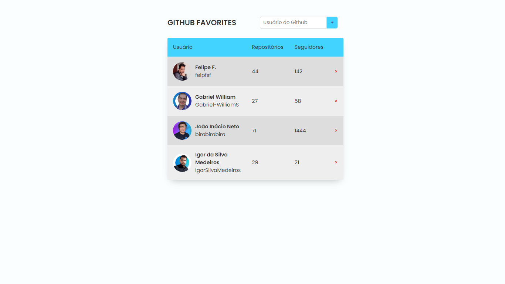

# github-favorites

Projeto 09 do Explorer da Rocketseat, cujo objetivo foi a criação de uma página de favoritos do GitHub, sendo possível adicionar ou remover favoritos, mostrando o usuário, a quantidade de repositórios e seguidores dos perfis favoritos.

